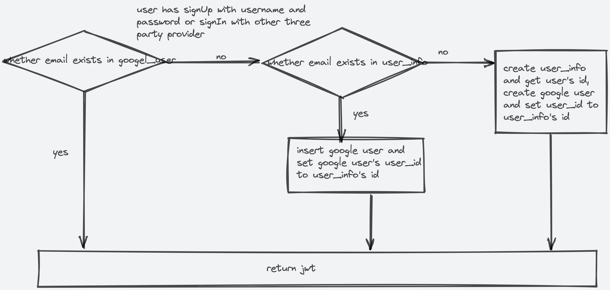

### Guide 
#### Deploy 
1. pull repository to local 
2. confirm that you have installed docker 
3. docker-compose build
4. docker-compose up 
#### Test Feature 
1. open localhost:3000 using the browser. 
2. click 'login with Google' Button. 
3. select the account and confirm. 
4. if you didn't connect to google analytics, the dialog will be opened, enter agree, incremental authentication will be triggered, and three charts will be displayed after you confirm it. if disagree, nothing will happen except the dialog is closed. 
5. you can view snapshot.gif in the current directory to get more information.
 
#### Design 
1. There are two tables, user_info, and provider_user, the relationship between them is one to many, one user can own many 3rd party providers. it's easy to add other third party providers or sign in with email and password, if someone signIn with GitHub or Facebook, you can extend this feature by add another provide_type field into provider_user table, if someone sign in with an email or username, you only need operate user_info table, email or username is unique. 

